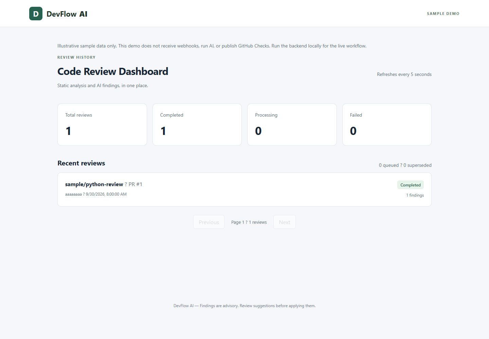
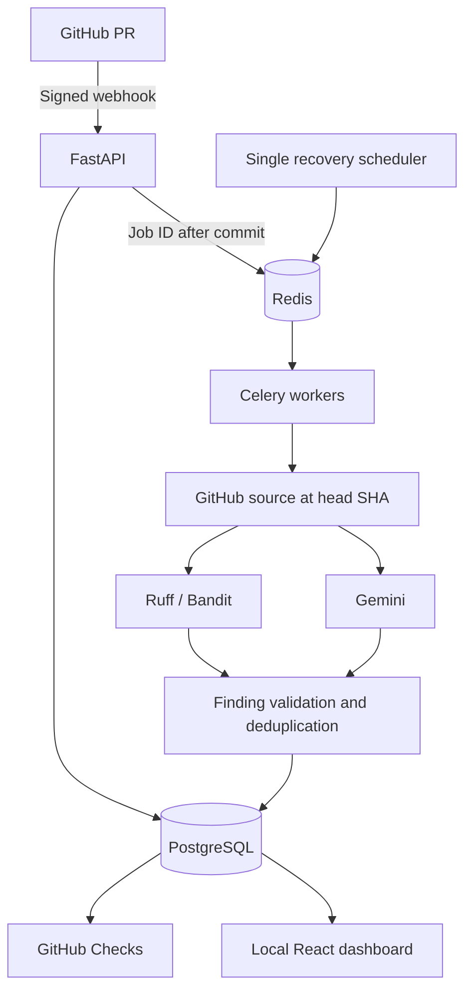

# DevFlow AI

DevFlow AI reviews Python pull-request changes with Ruff, Bandit, and a Gemini reviewer, validates findings, and publishes advisory GitHub Checks through a durable Celery pipeline.

## Demo

[Open the free Vercel demo](https://devflow-ai-demo.vercel.app). It is a **public sample-data dashboard**, not a hosted review pipeline.
It contains no private repository data, provider keys, or live API connection.
Run the full stack locally to inspect real persisted reviews.

Live GitHub-to-cloud acceptance remains incomplete: App credentials and an always-running backend host are still required. Gemini's last measured evaluation request returned HTTP 503.



[Sample finding](docs/images/finding-sample.png) ? [Architecture diagram](docs/images/architecture.svg)

## What It Does

Authenticates GitHub pull-request webhooks, persists a commit-specific review job,
queues its ID, fetches Python source at the exact head SHA, analyzes changes,
validates locations, stores a structured report, and publishes advisory findings.
The dashboard exposes history, component statuses, and suggested fixes.

## Architecture



See [architecture](docs/architecture.md) for implementation details.

## Features

- HMAC SHA-256 authentication before JSON processing.
- Delivery-ID and repository/PR/SHA uniqueness constraints.
- Full source retrieval with explicit file/diff/input limits and recorded skips.
- Ruff/Bandit plus optional structured Gemini findings.
- Separate analysis statuses, retained partial results, validated changed-line reports.
- Bounded retries, database leases, periodic recovery, stale-SHA checks.
- Check-ID reuse and annotation reconciliation, with batches of up to 50.
- Paginated dashboard with polling; automated unit, integration, and reliability tests.

These components are implemented and locally tested. Successful live GitHub publishing and the complete cloud workflow have not been verified.

## Tech Stack

Python, FastAPI, SQLAlchemy, Alembic, PostgreSQL, Redis, Celery, Ruff, Bandit,
Gemini REST API, React, TypeScript, Vite, Docker Compose, pytest, Playwright,
and GitHub Actions. Vercel Hobby hosts the sample frontend only.

## How It Works

The API commits before enqueueing. Workers load authoritative state from PostgreSQL
and analyze inert source files without executing repository code. Findings must
reference a real file and added line in the reviewed commit. Reports retain
original normalized findings and merge/rejection information. Publication checks
the PR head again; outdated jobs become superseded. Findings are advisory, not
proof of a bug. AI severity alone does not fail a Check Run.

## Local Setup

Requirements: Docker with Compose. Node 22.12+ is needed only for host frontend development.

```powershell
Copy-Item .env.example .env
# Edit .env locally; never commit real keys.
docker compose up -d --build
docker compose exec api alembic upgrade head
```

Open http://localhost:5173 and http://localhost:8000/docs. PostgreSQL and Redis
have no host ports; API/dashboard bind to loopback. One scheduler performs durable
job recovery. Scale workers with `docker compose up -d --scale worker=3`.
Set `AI_ENABLED=true` only when the Gemini key/model are configured. Provider
calls can incur cost; automated tests and infrastructure benchmarks use fakes.

## GitHub App Setup

Create an App with Checks read/write, Contents read, and Pull requests read.
Subscribe to pull_request events; accept any updated installation permissions.
Set GITHUB_APP_ID, place the PEM at the ignored `.secrets/github-app.pem`, and
set GITHUB_WEBHOOK_SECRET to a locally generated random value. Use the same
secret in the App. Route only `/api/webhooks/github` through an HTTPS tunnel.
Supported actions: opened, synchronize, reopened.

Set GITHUB_CHECKS_ENABLED=true on workers. Install the App on a dedicated test
repository, open a Python PR, verify the stored report, then inspect the Check
Run on its exact SHA. [Deployment instructions](docs/deployment.md) distinguish
the free frontend from the still-required backend host.

## API

| Method | Path | Purpose |
| --- | --- | --- |
| GET | /health | Database health |
| POST | /api/webhooks/github | Signed GitHub delivery |
| POST | /api/reviews | Create a queued review (409 for duplicate commit) |
| GET | /api/reviews?page=1&page_size=12 | Paginated history |
| GET | /api/reviews/{id} | Review state and metadata |
| GET | /api/reviews/{id}/findings | Raw normalized findings for audit |
| GET | /api/reviews/{id}/report | Validated combined report |
| GET | /api/metrics/summary | Status counts |

Read/create routes have no user authentication or repository authorization.
Keep them private. Manual review creation alone does not supply App installation
metadata; the signed PR webhook is the supported full-processing entry point.

## Testing

```powershell
docker cp evaluation devflow-api:/evaluation
docker compose exec api pytest --cov=app --cov-report=term-missing
```

The Day 12 run passed **167 tests with 89.78% backend line coverage**; all 112
unit tests also passed with an unreachable database. CI runs focused Ruff
correctness rules, migrations against PostgreSQL, pytest, and coverage artifacts.
No paid LLM or live GitHub request is allowed in the automated suite.
See [benchmarks](docs/benchmarks.md) for exact run dates and limitations.

## AI Evaluation

[35 labeled cases](evaluation/README.md) include buggy, clean, and unchanged-bug
examples. Static-only results: precision 27.27%, recall 30.00%, F1 28.57% under
strict line/category matching. These modest results include scoring-taxonomy
limitations. Gemini returned HTTP 503, so AI-only, combined, and grounding
comparisons remain unmeasured. [Methodology and raw results](docs/ai-evaluation.md)
are retained without relabeling cases to improve the scores.

## Performance Benchmarks

Use `compose.benchmark.yml` for an isolated simulated workload: real HTTP,
PostgreSQL, Redis, Celery, Ruff and Bandit, deterministic GitHub and AI fixtures.
It contains no provider credentials and does not publish Checks. AI_REVIEW_MODE=mock
is supported only by the explicitly selected benchmark worker entrypoint.

[Actual measurements and reproduction](docs/benchmarks.md) cover 50/100/250
events across 1/2/4 single-process workers and duplicate-delivery replay. These
are local load tests, not production traffic or real-model throughput.

## Security Considerations

Secrets stay in ignored environment/private-key files. App installation tokens
are temporary. Signature verification uses the raw body and constant-time
comparison. Static tools run with bounded timeouts, isolated config, and a
restricted environment; source files are never imported or executed. Repository
text is untrusted LLM input. Model output is validated and rendered as text.
Only the signed webhook endpoint should be publicly reachable until proper user
and repository authorization exist. The Vercel sample has no backend connection.

## Design Decisions

PostgreSQL is the source of truth; Redis transports IDs. Durable intent plus a
single recovery scheduler repairs the commit-to-queue gap. Leases protect final
writes after worker loss. Separate component/publication statuses preserve useful
results during partial failure. Deterministic path/line/category deduplication
preserves provenance. A small single-provider integration keeps scope manageable.

## Known Limitations

- Cloud backend and real GitHub acceptance are incomplete; the public frontend is a labeled sample.
- Gemini availability blocked live evaluation and meaningful cost/latency measurements.
- Whole-job retries can repeat analysis and incur cost; component resume is absent.
- GitHub provides no distributed exactly-once create guarantee; ambiguous remote failures remain possible.
- Head SHA can change just after the last publication check.
- Default crash recovery may take about 31 minutes plus queue backlog.
- Coverage measures executed lines, not semantic correctness or production readiness.
- Synthetic benchmark labels need independent review; small fixtures do not represent arbitrary repositories.

## Future Improvements

Complete live deployment acceptance and independent evaluation first. Then consider
repository authorization, component-level resumption, better observability, calibrated
findings, and additional languages. Feature development is otherwise frozen.
