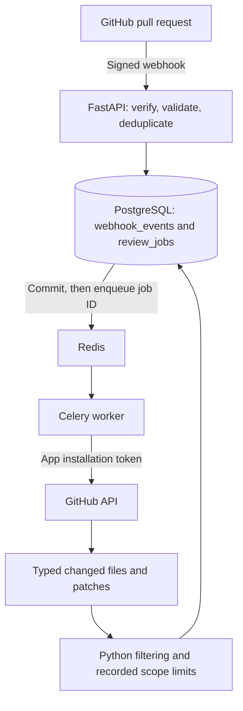

# DevFlow AI Architecture

## Current architecture — Day 2

The implemented backend accepts review-job requests through HTTP. GitHub pull
requests are the intended input, with signed PR webhook ingestion now implemented (see the ingestion section below).
GitHub App installation and public delivery configuration are external setup steps.

```text
                         DEVFLOW AI

                         GitHub
                            │
                     Pull Request
                            │
                   (integration planned)
                            │
                            ▼
                   ┌─────────────────┐
                   │     FastAPI     │
                   │                 │
                   │ Review-job API  │
                   └────────┬────────┘
                            │
                            ▼
                   ┌─────────────────┐
                   │   PostgreSQL    │
                   │                 │
                   │   Review Jobs   │
                   └─────────────────┘
```

Docker Compose runs FastAPI, PostgreSQL, and Redis. Redis infrastructure is
available, but jobs are not yet enqueued or processed by workers. A `queued`
status is the initial persisted state, not evidence that a worker is running.

### API and persistence

| Method | Route | Implemented behavior |
| --- | --- | --- |
| GET | `/` | Service information |
| GET | `/health` | Database connectivity check and service status |
| POST | `/api/reviews` | Persist a review job; return HTTP 201 |
| GET | `/api/reviews/{review_id}` | Retrieve a persisted job; return 404 if missing |

The `review_jobs` table contains `id`, `repository_name`, `pull_request_number`,
`head_sha`, `status`, `attempt_count`, `created_at`, `started_at`, and `completed_at`.
The last two timestamps are nullable until processing starts or completes.
Allowed statuses are `queued`, `processing`, `completed`, `failed`, and
`superseded`, enforced by a database check constraint. No state machine is implemented.
SQLAlchemy models define
database representations; Pydantic schemas define API request and response data.

The database constraint `uq_review_commit` makes the combination of repository
name, pull-request number, and head SHA unique. Repeating the same POST returns
HTTP 409 with `Review already exists for this commit.` This prevents duplicate
job records; worker retries and external side-effect deduplication remain future work.

Alembic manages schema changes using `Base.metadata` and `settings.database_url`.
The initial migration creates `review_jobs`; application startup does not use
`Base.metadata.create_all()`.

PostgreSQL stores data in the Compose named volume `postgres_data`. A review was
created and retrieved, then retrieved unchanged after `docker compose down` and
`docker compose up -d`. Removing volumes with `down -v` would remove this data.

### Backend layout

- `app/api/`: HTTP routes.
- `app/db/`: SQLAlchemy base, engine, and database sessions.
- `app/models/`: database representations.
- `app/schemas/`: API request and response structures.
- `app/config.py`: application settings.
- `migrations/`: versioned Alembic schema changes.
- `tests/`: backend tests.

## Future Day 3+ architecture — planned

```text
                         GitHub
                            │
                         Webhook
                            ▼
                         FastAPI
                         │     │
                         │     └──── PostgreSQL
                         │
                         ▼
                        Redis
                         │
                         ▼
                    Celery Worker
                     │         │
                     ▼         ▼
                  Static    AI Review
                 Analysis      LLM
                     \         /
                      \       /
                       ▼     ▼
                       Findings
                          │
                          ▼
                    GitHub Checks
```

A GitHub App will receive signed webhook events through FastAPI. The backend
will persist review jobs in PostgreSQL and enqueue work through Redis. Celery
workers will retrieve changes, run static analysis and LLM review, and produce
findings for GitHub Check Runs.

Webhook validation and review-job ingestion are implemented. Task dispatch, workers,
static analysis, LLM review, and GitHub Check publication are not implemented yet. PostgreSQL is intended to
remain the durable source of job state as retries and recovery are added.


## Authenticated webhook ingestion

`POST /api/webhooks/github` verifies HMAC-SHA256 over the raw body before
JSON parsing. Missing or invalid signatures return 401; an unconfigured secret
returns 503. Authenticated deliveries require `X-GitHub-Delivery` and
`X-GitHub-Event`. Pull request actions `opened`, `synchronize`, and `reopened`
create review jobs. Other events/actions return `status: ignored`.

`webhook_events` records delivery ID (unique primary key), event type, action,
received time, and status (`processed` or `ignored`). The delivery insert and
review insert commit in one PostgreSQL transaction. A failed transaction rolls
back both, allowing a retry. `ON CONFLICT DO NOTHING` handles concurrent delivery
retries without a check-then-insert race. A repeated delivery returns
`status: duplicate`; distinct deliveries targeting the same repository/PR/SHA
return the existing review ID through the separate review unique constraint.

Accepted responses include `review_id` and `review_target`. `processed` means
webhook ingestion finished, not that AI review ran. Jobs remain queued.
A real GitHub delivery additionally requires an installed App, Pull request
subscriptions, the matching webhook secret, and a reachable public webhook URL.


## Celery queue foundation

The supported webhook fast path is authenticate -> persist -> enqueue -> HTTP 202.
A separate Compose `worker` consumes Redis tasks and updates PostgreSQL. Ignored
and fully handled duplicate deliveries still return 200. PostgreSQL remains the
source of review state; only the review UUID is sent to Celery.

Delivery `review_id` links a pending publication to its persisted job. After a
successful broker publish, delivery status becomes `enqueued`. A publish failure
returns 503 and leaves it pending; redelivery retries publication. A process crash
between commit and publish still requires manual redelivery: an automatic outbox
relay is not implemented. A crash after publish may produce a duplicate task.
GitHub does not automatically redeliver failed webhook deliveries.

The initial task is a scaffold, not a code review: it records processing/completion
timestamps and increments attempts in one row-locked transaction. Completed or
otherwise nonqueued jobs are skipped. Thus duplicate tasks do not repeat this
unit of database work. `completed` currently means scaffold execution completed;
no analysis or findings exist yet. External analysis will require a different
transaction/claim strategy and explicit retry/failure recovery.

Celery uses `REDIS_URL` for its broker and expiring result state:
- `task_track_started=True` exposes STARTED in Celery's result backend; it does not
  update the SQLAlchemy job automatically.
- `task_acks_late=True` acknowledges after task execution. Redelivery is possible;
  it is not exactly-once execution, and abrupt child-process exits may still be
  acknowledged under default Celery behavior.
- `worker_prefetch_multiplier=1` limits reservations to one message per worker
  process, helping distribute slow tasks fairly with late acknowledgements.

The API still supports manual `POST /api/reviews` creation as before; automatic
queue submission currently applies to supported GitHub webhooks.


### Worker scaling verification

The worker service has no fixed container name. Scale it with
`docker compose up -d --scale worker=3` and follow execution with
`docker compose logs -f worker`. Each container currently has two execution
processes (`--concurrency=2`), giving six execution slots across three replicas.

A local signed-webhook test on 2026-09-23 submitted 12 distinct review targets.
All requests returned 202 and all reviews completed with attempt_count=1.
Logs confirmed four jobs on each worker replica; PostgreSQL timestamps showed
six overlapping executions. This was a local signed test, not a real GitHub PR
delivery. The scaffold changes processing and completed within one transaction,
so processing is not separately observable through another database connection.


## GitHub changed-file retrieval

The worker now replaces simulated work with GitHub App installation authentication
and changed-file retrieval. `app/services/github_service.py` owns JWT signing,
installation-token exchange/expiry, PR lookup, paginated file listing, file-content
lookup, and an optional Check Run helper. Check Runs are not published by the worker.
No personal access token is used.

Configuration: set `GITHUB_APP_ID` in the ignored root `.env`, and place the App
private key at `.secrets/github-app.pem`. The worker mounts this directory read-only
at `/run/secrets`. `GITHUB_PRIVATE_KEY_PATH` is the container path. PEM/key files
are ignored by Git and excluded from the backend build context. Grant the App
Pull requests: read for PR retrieval, Contents: read for content lookup, and only
add Checks: write when Check Runs are enabled. Install it on the target repository.

The authenticated webhook persists `installation_id`. Redis still carries only
the review UUID. The worker commits `processing`, releases its database transaction,
fetches GitHub data, then stores `changed_files` as JSONB and finishes the job.
Each file contains filename, status, additions, deletions, changes, and patch.
Missing patches (including binary files) remain null; GitHub patches may be
incomplete and this implementation does not reconstruct missing hunks.

Pagination uses 100 files per page. PRs beyond GitHub's 3,000-file limit fail
explicitly. Head/base changes during retrieval mark the job superseded. Safe
error codes are persisted without tokens, key material, or response bodies.
`completed` currently means retrieval succeeded, not AI review. Failed tasks
are not automatically retried; crash recovery for stuck processing jobs remains
future reliability work. Historical/manual jobs without an installation ID fail
with `missing_installation_id` if submitted to the worker.

Validation uses mocked GitHub responses and temporary test signing keys. A live
App-authenticated retrieval requires the user's App ID, private key, installation,
and repository permissions; local tests do not establish that configuration.


## Review scope and retry policy

The service converts GitHub responses to `ChangedFile` models at the boundary.
The worker uses a typed PR snapshot, then selects Python patches in filename
order. `MAX_FILES=20`, `MAX_PATCH_CHARS_PER_FILE=20000`, and
`MAX_TOTAL_PATCH_CHARS=100000` are positive configurable starting limits passed
to workers through Compose. Character counts use Python string length, not tokens.

Only `.py` is eligible. Vendor/build/generated directories, lock files, generated
filename/header markers, removed files, missing patches, and recognized binary
patches are excluded. Generated/binary detection is conservative and heuristic;
GitHub may omit or truncate patches, and missing hunks are not reconstructed.
Oversized patches are skipped whole, never silently sliced. File and total limits
apply to selected files. Smaller later files may fit after an oversized file is
skipped. Every decision is persisted in `scope_summary.skipped_files`, including
reason and original patch length; only selected files retain their patch content.
`status=completed` with `scope_summary.limited=true` means retrieval finished with
omissions. It does not mean an AI review has happened. The summary stores the
limits used so future configuration changes do not erase that context.

Review jobs retain denormalized `github_repository_id`, `installation_id`, PR
number, head SHA, and base SHA. Webhook metadata is persisted initially; successful
retrieval records the stable snapshot's repository ID and base SHA. Historical
rows remain nullable rather than inventing missing identifiers.

Timeouts, 408/429, 5xx, and rate-limit 403 responses are temporary failures. The
worker resets the job to queued and requests up to three Celery retries with
exponential backoff, respecting longer GitHub Retry-After/reset delays. Attempts
are capped at four across duplicate deliveries as well. Permanent failures and
exhausted retries persist failed state and raise so Celery records task failure.
Retry publication failure records `retry_publish_failed`. Crash recovery and a
transactional outbox remain future work; this is not exactly-once execution.


## Day 5 retrieval architecture



This is the implemented target path. The live GitHub App/public-webhook connection
is not yet verified because the worker's App ID and private key are unconfigured.
See the [engineering log](engineering-log.md) for the three intentional PRs,
actual local measurements, and the distinction between fixture verification and
end-to-end App-authenticated retrieval. Ruff, Bandit, and LLM findings remain
future work and are not part of this diagram's implemented processing.
