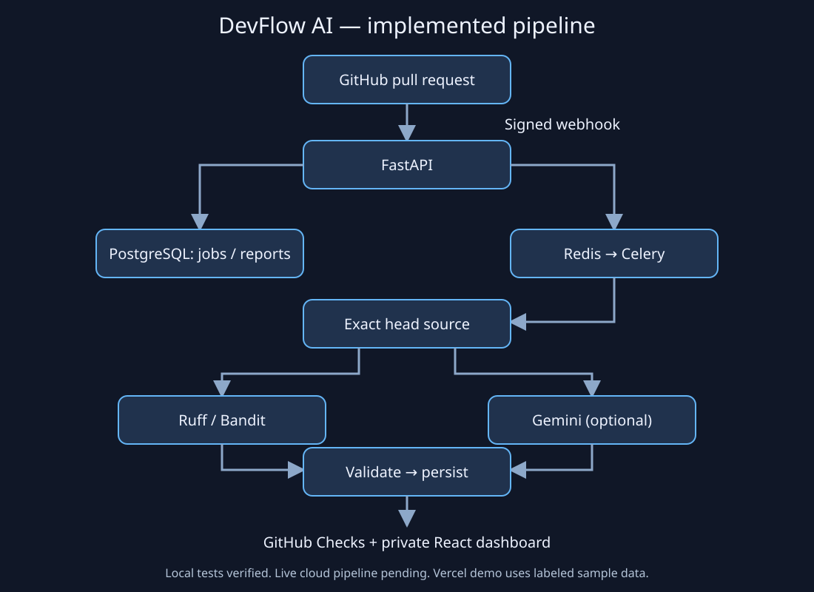

# Architecture

DevFlow is an asynchronous Python PR-review pipeline. Implementation is locally
verified; live GitHub/cloud acceptance is still pending. The public Vercel site
is a labeled sample-data frontend, independent of the private backend.

## Request path

FastAPI authenticates raw webhook bytes with HMAC SHA-256 before parsing JSON.
Supported pull_request actions are opened, synchronize, and reopened. Delivery
IDs and repository/PR/SHA identities have PostgreSQL unique constraints. The
transaction commits before Celery receives a review ID. The response is 202;
completed duplicate deliveries return a duplicate acknowledgment.

## Processing path

Redis carries IDs. A Celery task claims a PostgreSQL row using a lease token,
fetches PR metadata and full Python source at the exact head commit through App
installation authentication, and applies file/diff/source-size limits. Ruff and
Bandit analyze inert files in a temporary directory. Optional Gemini review uses
separate instructions and untrusted code data with bounded input/output/retries.

Validation checks schema, known paths, valid new-file positions, and added diff
lines. Deduplication uses path/line/category with provenance. Original normalized
findings and the validated report persist together. Each component reports its
own status; partial failure preserves useful findings without claiming full success.

## Publication and read path

A separate task publishes the persisted report to GitHub Checks. It rechecks the
PR head before creating, annotating, and completing the check. A moved head marks
the review superseded. Persisted check IDs, external-ID lookup, and annotation
fingerprints reduce duplicate effects; no distributed exactly-once guarantee is
claimed. Annotations are sent in batches of up to 50. LLM severity is advisory.

The React dashboard polls paginated API endpoints. Live API/dashboard access is
local/private because user authentication and repository authorization are absent.
The Vercel sample bundles synthetic data and never contacts those endpoints.

## Recovery

One Celery Beat scheduler scans durable database state every 30 seconds. Tasks
use bounded retries and persisted next-attempt deadlines. Claims expire after
the configured task limit plus 30 seconds. Late acknowledgments and worker-loss
redelivery complement recovery; lease tokens prevent stale attempts from writing
final state. Whole-job retries may repeat provider work and cost.

## Benchmarks and boundaries

compose.benchmark.yml uses its own PostgreSQL/Redis network and volumes. Its
explicit benchmark worker substitutes deterministic GitHub and AI adapters while
running real static tools and database/report code. It refuses to start outside
ENVIRONMENT=benchmark / AI_REVIEW_MODE=mock or with a provider key/publishing.
Normal workers never import that entrypoint. See [measurements](benchmarks.md).

The current deployable free artifact is the Vercel sample UI. A continuously
running backend host, working provider, GitHub App credentials and permissions,
and a real laptop-closed PR test are required before claiming complete deployment.
